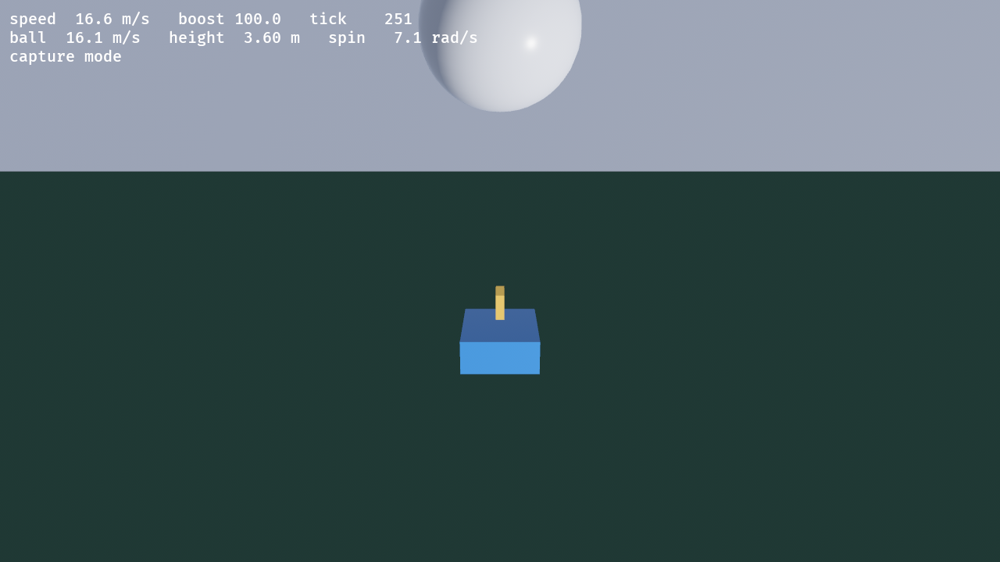

# rl

A hand-rolled, deterministic Rocket League style physics simulation with two
front ends: a dependency-free terminal demo, and a Bevy 3D viewer.



_The Bevy viewer at tick 251: the car driving into the ball mid-launch._

See **[docs/PHYSICS.md](docs/PHYSICS.md)** for why the physics are hand-rolled
rather than run on a general engine, plus honest caveats about determinism and
performance.

## Play it in 3D (Bevy)

```sh
cargo run -p rl_view             # already built: starts in about a second
cargo run --release -p rl_view   # smoother, but the first run rebuilds Bevy
```

The dev profile is set up to be playable (this crate at `opt-level = 1`, all
dependencies at `opt-level = 3`), so plain `cargo run` is the one to reach for.

| Key                       | Gamepad     | Action             |
| ------------------------- | ----------- | ------------------ |
| `W` `A` `S` `D` or arrows | left stick  | drive              |
| `I` `J` `K` `L`           | right stick | look around        |
| `ctrl`                    | `A`         | jump               |
| `space`                   | `B`         | boost              |
| `shift`                   | `X`         | drift (handbrake)  |
| `R`                       | `start`     | reset car and ball |
| `esc`                     | -           | quit               |

Keyboard and pad are merged per axis, so either works and holding both does not
cancel out. On the pad the triggers are analogue throttle: pull the right trigger
to accelerate, the left to reverse. Jump (`ctrl` / `A`) is edge-triggered, and
pressing it again while airborne gives a double jump. The right stick (or `IJKL`)
swivels the camera around the car and springs back to centre when released;
vertical look is inverted (push up to look down). (If your pad reports nothing,
see the gamepad section under "A note on Bevy's features" below.)

The camera trails the car and leans its aim toward the ball. This needs a GPU
and a window; it was developed on Vulkan.

### From Zed

`.zed/tasks.json` defines all of the commands below as project tasks, so you
don't have to remember them. Run `task: spawn` (`cmd-shift-p` → "task: spawn")
and pick one, or `task: rerun` to repeat the last one.

| Task                                  | What it does                                       |
| ------------------------------------- | -------------------------------------------------- |
| `RL: play 3D (Bevy)`                  | the viewer                                         |
| `RL: play 3D (Bevy, release)`         | same, optimised (first run rebuilds Bevy: minutes) |
| `RL: play 3D (Bevy, gamepad debug)`   | viewer, plus a log of every pad event              |
| `RL: gamepad probe (mapping report)`  | how gilrs mapped the connected pad                 |
| `RL: play terminal (scripted demo)`   | no-input animation, then exits                     |
| `RL: play terminal (WASD)`            | interactive terminal demo                          |
| `RL: run tests`                       | `cargo test --workspace`                           |
| `RL: cargo check`                     | type-check the workspace on demand (see below)     |
| `RL: clippy (workspace, all targets)` | lints                                              |
| `RL: render screenshot (tick 250)`    | dump a frame to `docs/screenshot.png`              |
| `RL: physics throughput bench`        | ticks/s                                            |

To put one on a key, add to your `keymap.json`:

```json
{
  "context": "Workspace",
  "bindings": {
    "alt-r": [
      "task::Spawn",
      { "task_name": "RL: play 3D (Bevy)", "reveal_target": "center" }
    ]
  }
}
```

(Note `reveal_target` belongs in the keybinding, not the task definition.)

### Why rust-analyzer is not allowed to check on save

`.zed/settings.json` sets two rust-analyzer options for this project:

- `checkOnSave: false` — by default rust-analyzer runs
  `cargo check --workspace --all-targets` on every save. With Bevy in the
  workspace that re-checks a large dependency tree on each save and pegs the CPU.
- `cargo.targetDir: true` — rust-analyzer gets its own target directory
  (`target/rust-analyzer`) instead of sharing `target/`. Cargo holds an
  exclusive lock on the target directory while building, so without this
  rust-analyzer's check and a `cargo build`/`cargo run` block each other: whichever
  started second waits for the other's lock.

Together these stop the auto-check churn and the lock contention. When you do want
cargo's diagnostics, run the `RL: cargo check` task — its output is clickable.

You can also have it render a single frame and exit, which is handy for CI or
for eyeballing a change:

```sh
cargo run --release -p rl_view -- --screenshot shot.png 250
#                                              path      tick to capture
```

## Play it in the terminal

```sh
cargo run --release -p rl --bin play
cargo run --release -p rl --bin play -- --interactive   # WASD drive, space boost, z drift, j jump
```

The terminal build is worth keeping around: it is the same `World::step`, with
no engine or GPU in the way, so it is what the determinism tests drive.

## What this proves

- **The simulation is engine-free.** `rl` has zero dependencies and no
  rendering code. The Bevy viewer is a separate crate that reads state and
  writes transforms; nothing in the draw path can feed back into the physics.
- **Determinism is unaffected by the viewer.** `cargo test` still asserts
  identical state hashes across runs and threads, with Bevy in the workspace.
- **Headless is a first-class path.** `cargo test` runs the physics, the
  terminal demo renders it, and the Bevy app can dump a frame without a human.

## Layout

```
Cargo.toml        workspace; `rl` is the root package
src/              the simulation (no dependencies)
  math.rs         Vec3, hashing, deterministic sin/cos for rotation
  arena.rs        the six planes that make up the arena
  ball.rs         sphere: gravity, drag, Magnus, contact friction -> spin
  car.rs          bespoke driving model (not a rigid body) + box hitbox
  world.rs        120 Hz fixed step, input, state hash, snapshots
  bin/play.rs     terminal front end (scripted + interactive)
tests/            physics behaviour + determinism
view/             Bevy 3D viewer (`rl_view`)
docs/             physics write-up and the screenshot above
```

## A note on Bevy's features

`view/Cargo.toml` spells out its Bevy features rather than using the `3d`/`ui`
meta-features, because those pull in `default_platform`, which drags in
`bevy_audio` (needs ALSA). Nothing here makes noise, so audio is left out and the
viewer builds without it.

Gamepad support _is_ included, via the `bevy_gilrs` feature. On Linux, gilrs needs
`libudev`, so building the viewer requires one system package:

```sh
sudo apt-get install libudev-dev
```

A pad is mapped through gilrs' copy of the SDL controller database, keyed by
device id. Popular pads are in that database; less common ones fall back to a
built-in default that maps the raw evdev buttons and axes directly. Two tools
cover the case where a pad is detected but its controls are wrong:

```sh
cargo run -p rl_view --example gamepad_probe   # what mapping was picked, no input needed
cargo run -p rl_view -- --gamepad-debug        # log every button/axis change live
```

One thing the default mapping does that surprises people: it exposes the X-Box
analogue triggers as the _axes_ `LeftZ`/`RightZ` (evdev ABS_Z/ABS_RZ), not as
trigger buttons. The viewer reads either, so both mapped and unmapped pads work.
