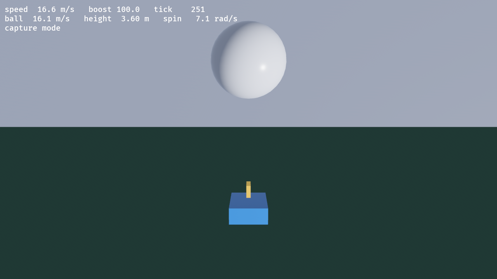

# rl_sim

A hand-rolled, deterministic Rocket League style physics simulation with two
front ends: a dependency-free terminal demo, and a Bevy 3D viewer.



_The Bevy viewer at tick 251: the car driving into the ball mid-launch._

See **[docs/PHYSICS.md](docs/PHYSICS.md)** for why the physics are hand-rolled
rather than run on a general engine, plus honest caveats about determinism and
performance.

## Play it in 3D (Bevy)

```sh
cargo run -p rl_view             # already built: starts in about a second
cargo run --release -p rl_view   # smoother, but the first run rebuilds Bevy
```

The dev profile is set up to be playable (this crate at `opt-level = 1`, all
dependencies at `opt-level = 3`), so plain `cargo run` is the one to reach for.

| Key                       | Action             |
| ------------------------- | ------------------ |
| `W` `A` `S` `D` or arrows | drive              |
| `space`                   | boost              |
| `shift`                   | drift (handbrake)  |
| `R`                       | reset car and ball |
| `esc`                     | quit               |

The camera trails the car and leans its aim toward the ball. This needs a GPU
and a window; it was developed on Vulkan.

### From Zed

`.zed/tasks.json` defines all of the commands below as project tasks, so you
don't have to remember them. Run `task: spawn` (`cmd-shift-p` → "task: spawn")
and pick one, or `task: rerun` to repeat the last one.

| Task                                  | What it does                                       |
| ------------------------------------- | -------------------------------------------------- |
| `RL: play 3D (Bevy)`                  | the viewer                                         |
| `RL: play 3D (Bevy, release)`         | same, optimised (first run rebuilds Bevy: minutes) |
| `RL: play terminal (scripted demo)`   | no-input animation, then exits                     |
| `RL: play terminal (WASD)`            | interactive terminal demo                          |
| `RL: run tests`                       | `cargo test --workspace`                           |
| `RL: clippy (workspace, all targets)` | lints                                              |
| `RL: render screenshot (tick 250)`    | dump a frame to `docs/screenshot.png`              |
| `RL: physics throughput bench`        | ticks/s                                            |

To put one on a key, add to your `keymap.json`:

```json
{
  "context": "Workspace",
  "bindings": {
    "alt-r": [
      "task::Spawn",
      { "task_name": "RL: play 3D (Bevy)", "reveal_target": "center" }
    ]
  }
}
```

(Note `reveal_target` belongs in the keybinding, not the task definition.)

You can also have it render a single frame and exit, which is handy for CI or
for eyeballing a change:

```sh
cargo run --release -p rl_view -- --screenshot shot.png 250
#                                              path      tick to capture
```

## Play it in the terminal

```sh
cargo run --release -p rl_sim --bin play
cargo run --release -p rl_sim --bin play -- --interactive   # WASD in-terminal
```

The terminal build is worth keeping around: it is the same `World::step`, with
no engine or GPU in the way, so it is what the determinism tests drive.

## What this proves

- **The simulation is engine-free.** `rl_sim` has zero dependencies and no
  rendering code. The Bevy viewer is a separate crate that reads state and
  writes transforms; nothing in the draw path can feed back into the physics.
- **Determinism is unaffected by the viewer.** `cargo test` still asserts
  identical state hashes across runs and threads, with Bevy in the workspace.
- **Headless is a first-class path.** `cargo test` runs the physics, the
  terminal demo renders it, and the Bevy app can dump a frame without a human.

## Layout

```
Cargo.toml        workspace; `rl_sim` is the root package
src/              the simulation (no dependencies)
  math.rs         Vec3, hashing, deterministic sin/cos for rotation
  arena.rs        the six planes that make up the arena
  ball.rs         sphere: gravity, drag, Magnus, contact friction -> spin
  car.rs          bespoke driving model (not a rigid body) + box hitbox
  world.rs        120 Hz fixed step, input, state hash, snapshots
  bin/play.rs     terminal front end (scripted + interactive)
tests/            physics behaviour + determinism
view/             Bevy 3D viewer (`rl_view`)
docs/             physics write-up and the screenshot above
```

## A note on Bevy's features

`view/Cargo.toml` spells out its Bevy features rather than using the `3d`/`ui`
meta-features, because those pull in `default_platform`, which drags in
`bevy_gilrs` (needs `libudev`) and `bevy_audio` (needs ALSA). Neither is
installed on a bare machine and the viewer needs neither, so listing features
explicitly keeps the build self-contained with nothing to install. If you want
gamepad support in the viewer later, add `bevy_gilrs` back and install
`libudev-dev`.
